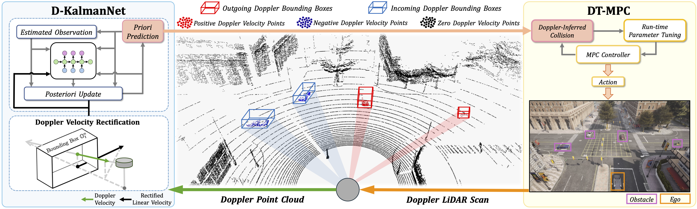

# DPNet: Doppler LiDAR Motion Planning for Highly-Dynamic Environments

<a href="https://arxiv.org/pdf/2512.00375"></a>
<a href="https://ieeexplore.ieee.org/abstract/document/11488574"></a>
<a href="https://youtu.be/fjQ_o6b9oSg"></a>
<a href="https://b23.tv/O4QgGEK"></a>

This is the project page of the RA-L '26 paper:  
### DPNet: Doppler LiDAR Motion Planning for Highly-Dynamic Environments  

***Authors:***  
[Wei Zuo](https://github.com/UUwei-zuo), [Zeyi Ren](https://scholar.google.com/citations?user=bdkdiw4AAAAJ&hl=zh-CN), [Chengyang Li](https://github.com/KevinLADLee), [Yikun Wang](https://scholar.google.com/citations?user=nEgyU6MAAAAJ&hl=en&oi=sra), [Mingle Zhao](https://github.com/zha0ming1e), [Shuai Wang](https://scholar.google.com/citations?user=W7WcEW0AAAAJ&hl=zh-CN), [Wei Sui](https://scholar.google.com/citations?user=0vckuD8AAAAJ&hl=zh-CN), [Fei Gao](https://scholar.google.com/citations?hl=zh-CN&user=4RObDv0AAAAJ&view_op=list_works), [Yik-Chung Wu](https://scholar.google.com/citations?hl=en&user=pEpkokUAAAAJ&view_op=list_works), and [Chengzhong Xu](https://scholar.google.com/citations?user=XsBBTUgAAAAJ&hl=en).

https://github.com/user-attachments/assets/d80881d1-aa0a-44c6-b84b-5080b59a3114

## 🚀 Update

**[28-Apr-2026]** Code is released.  
**[10-Apr-2026]** Our work is accepted to IEEE Robotics and Automation Letters (RA-L).

# 📖 Introduction

Doppler LiDAR is a powerful sensor that provides the 4-th measuring dimension: **Doppler velocity**.
Apart from traditional spatial (x,y,z) measurement, Doppler velocity directly captures the instantaneous spatio-temporal knowledge for each point,
allowing accurate 4D scene understanding.
***Our work DPNet is the first framework to integrate Doppler LiDAR into closed-loop motion planning.*** By leveraging Doppler LiDAR, DPNet introduces:

- Doppler Kalman Neural Network (D-KalmanNet): a real-time obstacle motion prediction module.

- Doppler-Tuned Model Predictive Control (DT-MPC): a runtime prediction-triggered controller tuning module.

Built upon these two modules, DPNet achieves agile collision-free motion planning among fast moving obstacles, opening up new research paradigms of Doppler LiDAR guided robot motion planning.

|  | 
|:--------------------------------:| 
|        DPNet Architecture        |

### ***🔥 Watch the video introduction on [YouTube](https://youtu.be/fjQ_o6b9oSg) or [bilibili](https://b23.tv/O4QgGEK) ⬇️*** 

[](https://youtu.be/fjQ_o6b9oSg)

# 🛠️ Prerequisite

### Step 1 - ROS Noetic

DPNet requires [**ROS-noetic**](https://wiki.ros.org/noetic/Installation/Ubuntu). Migration to ROS 2 is in our future plan.

### Step 2 - carla-aeva

DPNet requires the [**carla-aeva**](https://github.com/aevainc/carla-aeva), where [**Aeva, Inc**](https://github.com/aevainc) enhances [**carla**](https://github.com/carla-simulator/carla) by Doppler LiDAR integration. 
To obtain, there are two ways:  
- **Build from Source**: Follow the steps in [**carla-aeva**](https://github.com/aevainc/carla-aeva) to build from source, optionally adding your custom items.  
- **Quick Download**: We provide pre-compiled version, available at [**Google Drive**](https://drive.google.com/file/d/1hGuX-Oas-z75fhxBzPzpmQ_5LENzWvis/view?usp=sharing) or [**Baidu NetDisk**](https://pan.baidu.com/s/1_vK-NtztvP8Z2FDQM3NIPQ?pwd=xhuu).

### Step 3 - Python API for carla-aeva

In Step 2, if you choose
- Build from Souce: Now you can compile your own Python API for any dedicated Python version.
- Quick Download: Now you will be using the provided [**Python API Release**](https://github.com/UUwei-zuo/DPNet/releases/tag/v1.0.0) for quick start.


# 🔌 Usage

## Quick Install & First Run

- We encourage using Conda to manage Python environments. Ensure that [**ROS-noetic**](https://wiki.ros.org/noetic/Installation/Ubuntu) and [**carla-aeva**](https://github.com/aevainc/carla-aeva) are installed. 
- Launch Carla first:
```bash
cd path_to_carla_aeva_on_your_computer
./CarlaUE4.sh
```
- Then, to run DPNet:

```bash
# clone DPNet with ros-bridge-DopplerLiDAR submodule
cd ~
git clone --recurse-submodules https://github.com/UUwei-zuo/DPNet.git
cd DPNet

# create Conda venv 
conda create -n dpnet python=3.9 -y
conda activate dpnet
pip install -r requirements.txt
conda install libffi==3.3 -y

# API for more Python versions are provided in project release
# If you build from source, you can install any dedicated API versions
WHEEL_URL_39="https://github.com/UUwei-zuo/DPNet/releases/download/v1.0.0/carla-0.9.15-cp39-cp39-linux_x86_64.whl"
WHEEL_FILE="carla-0.9.15-cp39-cp39-linux_x86_64.whl"
wget $WHEEL_URL_39
pip install $WHEEL_FILE && rm $WHEEL_FILE

# build workspace
source /opt/ros/noetic/setup.bash
catkin_make
source devel/setup.bash

# run DPNet example
python3 ./examples/DPNet_run.py
```

### Configuration

- **Highly-Dynamic Testbed**

To test DPNet, `scripts/carla_dynabarn.py` is provided to completely randomize highly-dynamic obstacles following [DynaBARN](https://github.com/aninair1905/DynaBARN). 
The Basic setting is at `examples/DPNet_hyperparameters.yaml`, where you can conveniently configure obstacle number/seed setting with:
```aiignore
Carla_DynaBARN:
  vehicles: 3 # obstacle number
  seed: 79 # obstacle seed
```
Advanced setting is at `scripts/carla_dynabarn.py`.

- **DPNet Hyperparameters**

Basic hyperparameter settings are at `examples/DPNet_hyperparameters.yaml`.
Detailed settings can be found in `src/dpnet_planner_ros/src/DPNet_planner.py`, `src/dpnet_planner_ros/src/DTMPC.py`, and `src/dpnet_planner_ros/src/action_solver.py`.

- **Doppler LiDAR Scan Pattern**

[carla-aeva](https://github.com/aevainc/carla-aeva) uses a scan pattern file to configure Doppler LiDAR simulation.
The simulation consumes GPU at runtime, so you can configure the pattern file located at `examples/Doppler_ScanPatterns.yaml` according to your computer specs.
For example, for higher processing frequency, you could reduce `points_per_line`; 
for higher perception granularity, you could increase `elevation_steps_deg`, etc.

# 📋 Miscellaneous

- **ROS-Bridge for Doppler LiDAR**

To connect [carla-aeva](https://github.com/aevainc/carla-aeva) with ROS,
[ros-bridge-DopplerLiDAR](https://github.com/UUwei-zuo/ros-bridge-DopplerLiDAR) is provided. 
It has been included in DPNet as a default submodule.

- **Q & A**

**Q1.** Why can D-KalmanNet's step interval `dt` mismatch DPNet planner's horizon interval `sample_time` in `examples/DPNet_hyperparameters.yaml` ?  
**A1.** D-KalmanNet predicts obstacle motions by using Doppler-perceived velocity to calculate future state transition with a dedicated motion model, e.g., `x'=x+vt+0.5*a*t^{2}` if considering constant acceleration.
However, carla adapts throttle-based ego vehicle control, which cannot guarantee an instant realization of the target velocity value in planner's solution.
As such, the actual ego control result typically mismatches the solution target.
This means that the expected one-step ego motion does not take an exact `sample_time` to finish.
Consequently, `dt` and `sample_time` can be tuned differently to alleviate the solution-to-control inconsistency, ensuring a better global performance.

# 🙌 Citation

We sincerely appreciate your citation if you find this work useful:

```
@article{zuo2026dpnet,
  author={Zuo, Wei and Ren, Zeyi and Li, Chengyang and Wang, Yikun and Zhao, Mingle and Wang, Shuai and Sui, Wei and Gao, Fei and Wu, Yik-Chung and Xu, Chengzhong},
  journal={IEEE Robotics and Automation Letters}, 
  title={DPNet: Doppler LiDAR Motion Planning for Highly-Dynamic Environments}, 
  year={2026},
  volume={11},
  number={6},
  pages={7190-7197},
  doi={10.1109/LRA.2026.3685933}
}
```

# 📪 Acknowledgement

Contact [Wei Zuo](https://github.com/UUwei-zuo) by zuowei@eee.hku.hk if you have any questions or suggestions.

## 📇 License
This repository is released under the MIT license. See [LICENSE](./LICENSE) for additional details.

